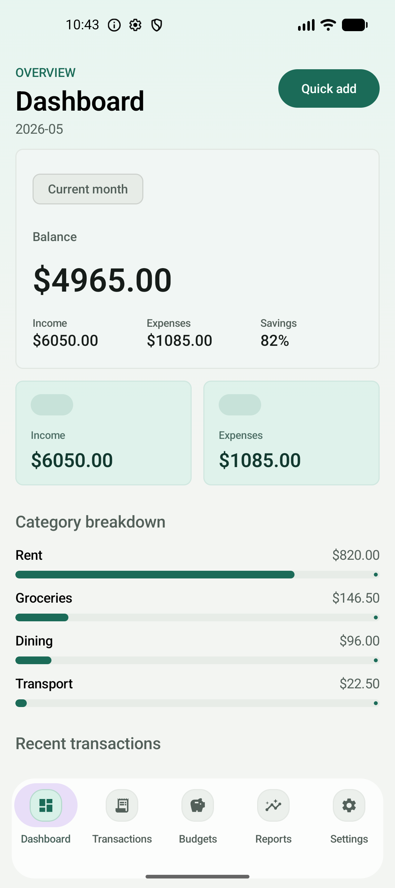
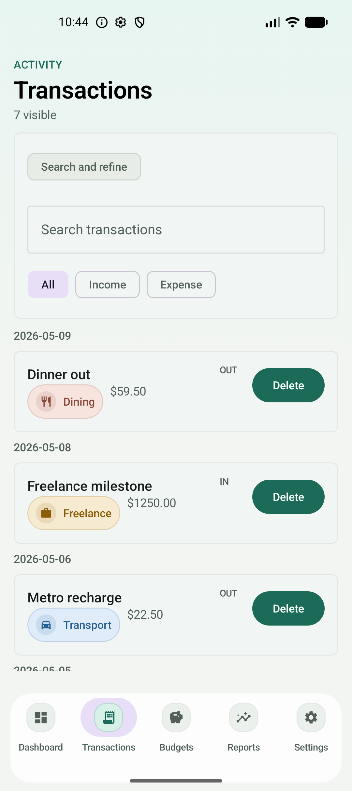
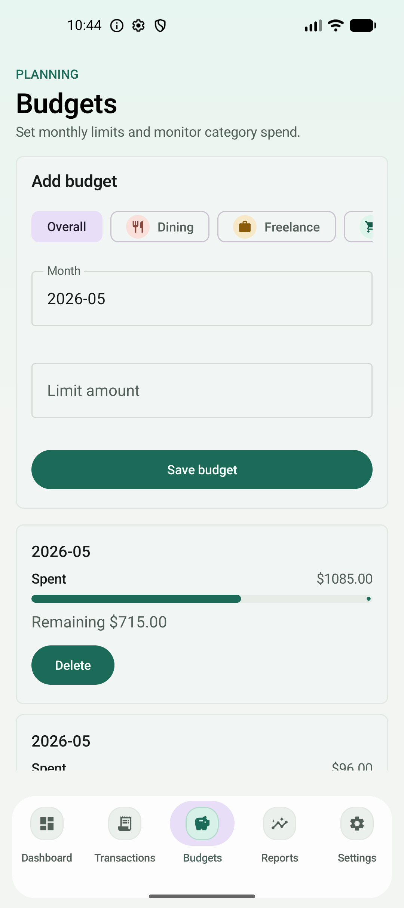
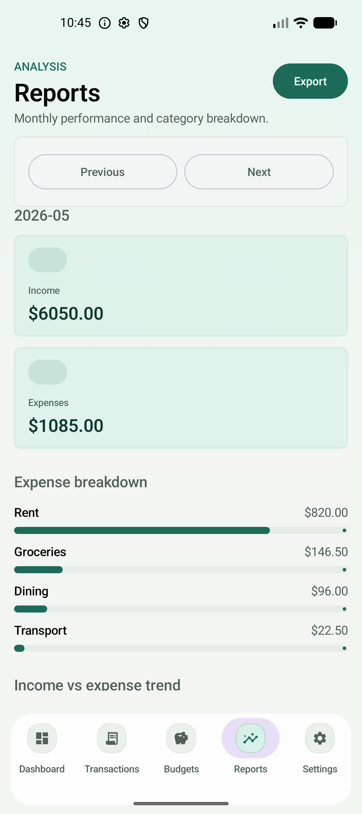

# FinTrack

FinTrack is a local-first Android personal finance tracker built with Kotlin, Jetpack Compose, Room, Coroutines/Flow, MVVM, Navigation Compose, WorkManager, and Material 3.

It is designed as a production-quality starter rather than a tutorial sample: transaction CRUD, budgets, reports, local export, settings, background work, and layered architecture with test coverage.

## Product Preview

<p align="center">
  
  
  
  
</p>

## What It Does

- Track income and expense transactions with categories, notes, dates, and recurring metadata
- Surface a monthly dashboard with balance, savings rate, category breakdown, and recent activity
- Search and filter transaction history
- Create category budgets and monitor progress against monthly limits
- Generate monthly reports and local CSV exports
- Persist all data locally with Room
- Run export and backup simulation work through WorkManager
- Support currency preference, dark mode, and app-level settings

## Tech Stack

- **Language:** Kotlin
- **UI:** Jetpack Compose + Material 3
- **Architecture:** MVVM + unidirectional data flow
- **Async state:** Coroutines + Flow + StateFlow
- **Persistence:** Room
- **Navigation:** Navigation Compose
- **Background work:** WorkManager
- **Testing:** unit tests, repository tests, Compose UI tests, worker tests

## Architecture

The app is organized by layer and keeps the data boundary explicit:

```text
app/src/main/java/com/fintrack/
  data/
    local/
      dao/
      db/
      entity/
      mapper/
    repository/
  domain/
    model/
    repository/
    usecase/
  ui/
    navigation/
    screen/
    component/
    theme/
  worker/
  di/
```

Runtime flow:

```text
Composable event
  -> ViewModel
  -> Use case
  -> Repository
  -> Room / local settings
  -> Flow emits
  -> ViewModel updates UiState
  -> Compose recomposes
```

Key implementation choices:

- composables render immutable state and send events upward
- ViewModels own one `StateFlow` per screen
- repositories are the only UI/domain data-access boundary
- money is stored in minor units (`Long`) to avoid floating-point drift
- settings flow drives app-wide concerns such as currency and dark mode

## Screens

- **Dashboard:** balance, monthly totals, savings rate, category spend, recent transactions
- **Transactions:** searchable and filterable transaction history grouped by date
- **Editor:** create and update transactions with validation and category/date selection
- **Categories:** maintain category taxonomy, icon, and color selection
- **Budgets:** monthly limits with progress and exceeded-budget feedback
- **Reports:** monthly summary and category breakdown with export action
- **Settings:** currency, dark mode, export, backup simulation, and maintenance actions

## Quality Highlights

- Room-backed persistence with explicit mappers and repository isolation
- App-level dark mode and currency setting propagation
- Local CSV export and backup simulation via WorkManager
- Real launcher icon and branded Android launch screen
- Coverage across domain logic, ViewModels, repository behavior, Compose screens, and workers

## Run Locally

Requirements:

- Android Studio
- Android SDK / compileSdk 36
- an emulator or physical Android device

Build the debug app:

```bash
./gradlew :app:assembleDebug
```

Install on a connected emulator/device:

```bash
./gradlew :app:installDebug
```

## Test Commands

Run JVM tests:

```bash
./gradlew :app:testDebugUnitTest
```

Compile instrumentation tests:

```bash
./gradlew :app:compileDebugAndroidTestKotlin
```

Run instrumentation tests on a connected emulator/device:

```bash
./gradlew :app:connectedDebugAndroidTest
```

## Notes

- CSV export writes to app-local `filesDir/exports`
- recurring rule support exists in the data/domain model, while automatic generation remains stretch scope
- the screenshot set in this README was captured from the running app on an Android emulator

## Roadmap

Possible next iterations:

- richer charts on dashboard and reports
- PDF export
- biometric lock
- recurring transaction generation
- cloud sync / backup beyond simulation
